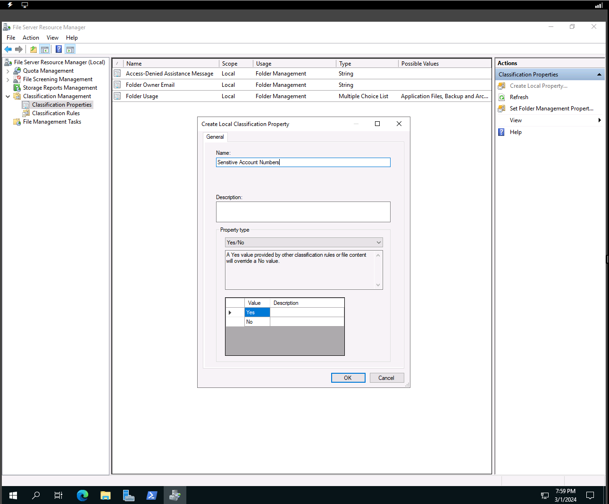
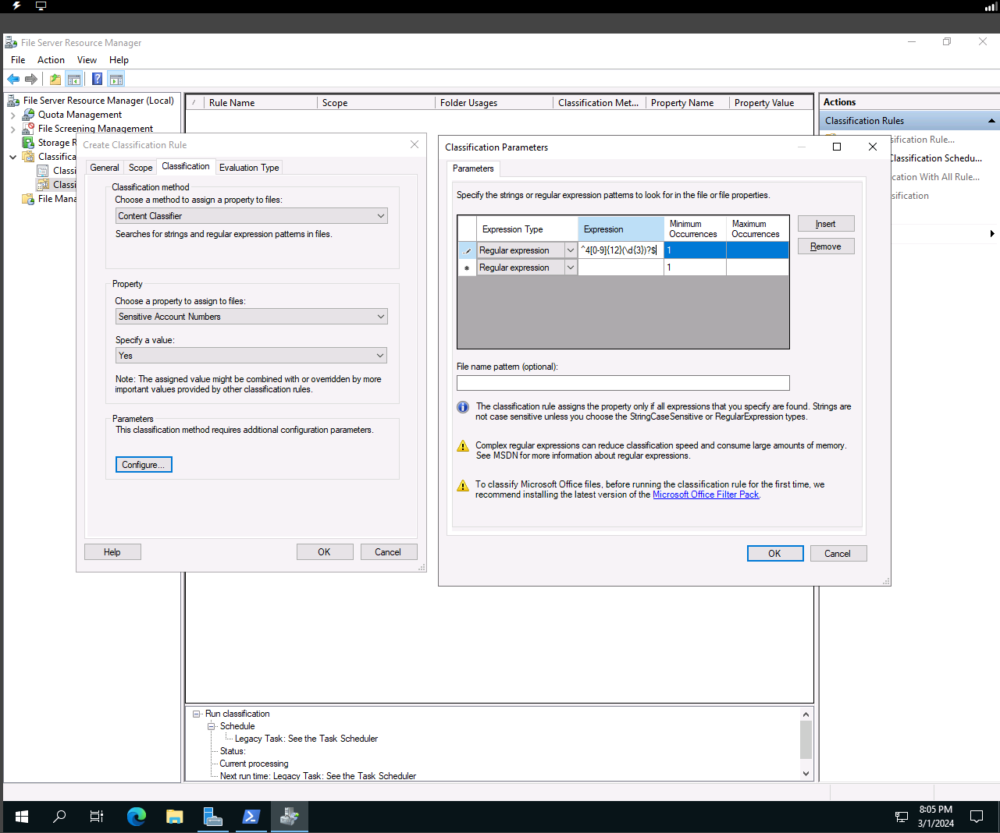
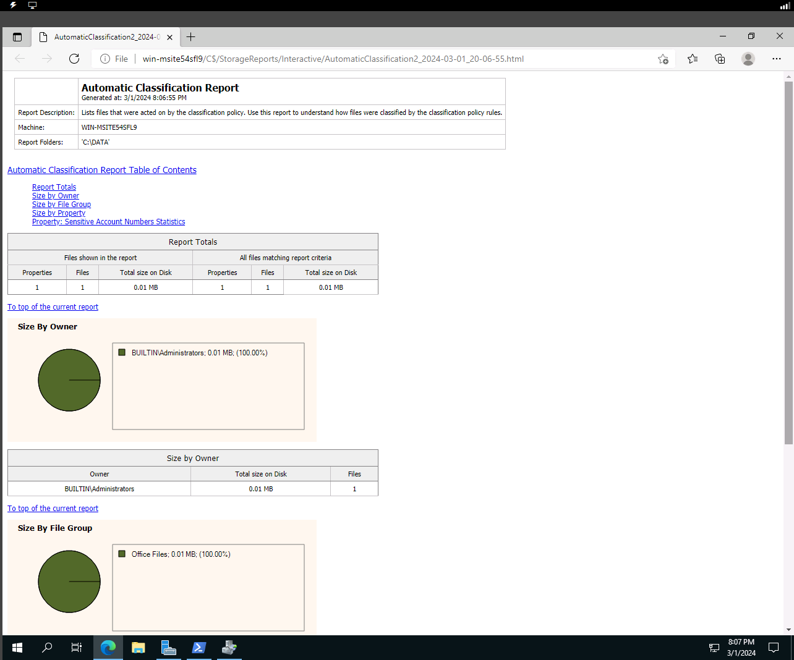
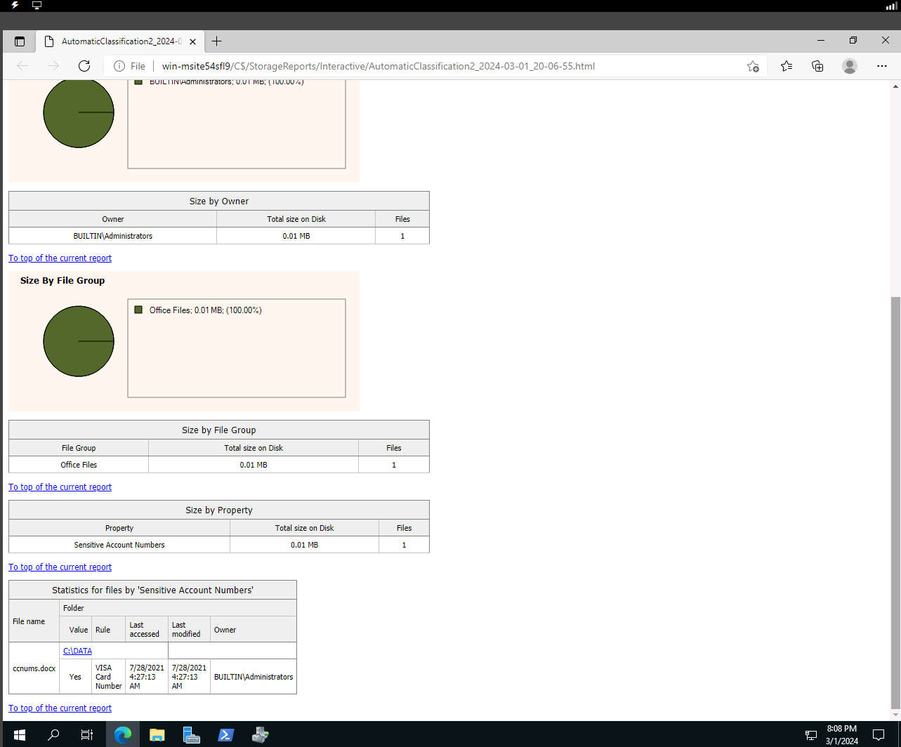

# fsrm

## Objective
To classify files automatically and apply policies based on classification.
Perform file management tasks, such as expiring or encrypting files.
Screen file types, preventing users from storing certain file formats.
Generate storage reports to monitor disk usage trends.

## File Server Resource Manager

